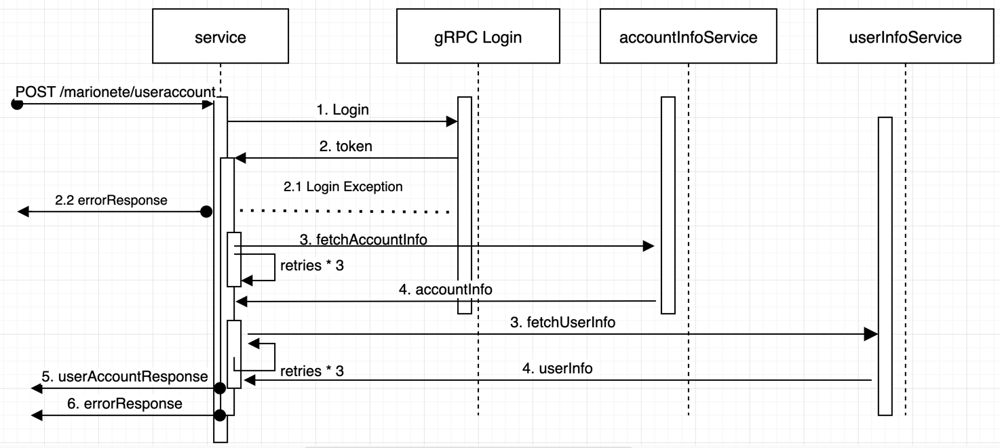

## Documentation

The service module is a SpringBoot application that implements a RestController for the below endpoint:

```
POST /marionete/useraccount/

{
    "username":"bla",
    "password":"foo"
}
```
And responds a json with this structure:
```
{
  "accountInfo": {
    "accountNumber": "12345-3346-3335-4456"
  },
  "userInfo": {
    "name": "John",
    "surname": "Doe",
    "sex": "male",
    "age": 32
  }
}

```

## Flow Diagram




## Here is how the below requirements are handled

* **Low Latency on high traffic:**
  * ```fetchAccountInfo``` and ```fetchUserInfo``` are being executed parallel using Java's ```CompletableFutures```. This would 
  ensure that the response time is no greater than the ```max(fetchAccountInfo, fetchUserInfo)```.
  * Also timeouts have been configured for both the userInfo and accountInfo service which can be tweaked as per wish
  * In Production we would also use circuit breakers like ```Hystrix``` to ensure robustness.

* **AccountInfoMock gives error on the first 2 calls:**
  * this has been handled by retrying in case of ```503 Service Unavailable```. Currently retrying 3 times in cases of any exception.

* **Implementation of gRPC Client/Server**
  * The gRPC Client is designed to make the call to the server in a synchronous way(blocking).
  * The gRPC Server is initialized when the application starts. It creates a server listening on the ```localhost:19999``` and 
  registers the LoginService with the server. The ```LoginService``` extends and implements the login method for the gRPC server.

* **Backend Mocks**
  * the backend mocks can be used in the dev environment. They are being started after the application starts in the main ```AccountServiceApplication.java``` class. Uncomment the mock start commands
    ```
    UserInfoMock.start()
    AccountInfoMock.start()
    ```
  * these mocks are being used in the test cases. They are stared once using the ```MockServer```, so mocks are being used in all the test cases.

* **TestCases**
  * Have written ```IntegrationTests``` and ```JUnit``` test cases for the ```AccountController``` and ```AccountServiceImpl``` classes. 
  * Also ran ```SonarAnalyser``` on the project removed all the code smells and warnings.